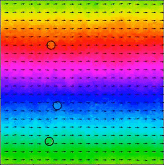

# Swarmalators

This repository contains the source code for the articles 

1. P. Degond, A. Diez, A. Walczak, *Topological states and continuum model for swarmalators without force reciprocity*, Anal. Appl. (Singap.), 20(6):1215–1270, 2022, [[Article]](https://www.worldscientific.com/doi/10.1142/S0219530522400073), [[Preprint]](https://arxiv.org/abs/2205.15739).

2. P. Degond, A. Diez, *Topological travelling waves of a macroscopic swarmalator model in confined geometries*, *TBC*.

## Abstract 
Swarmalators are systems of agents which are both self-propelled particles and oscillators. Each particle is endowed with a phase which modulates its interaction force with the other particles. In return, relative positions modulate phase synchronization between interacting particles. In the present model, there is no force reciprocity: when a particle attracts another one, the latter repels the former. This results in a pursuit behavior. 

In the first article, we derive a hydrodynamic model of this swarmalator system and show that it has explicit doubly-periodic travelling-wave solutions in two space dimensions. These special solutions enjoy non-trivial topology quantified by the index of the phase vector along a period in either dimension. Stability of these solutions is studied theoretically by investigating the conditions for hyperbolicity of the model and numerically using the present code. 

In the second article, we focus on the macroscopic model and investigate new classes of two-dimensional travelling-wave solutions confined in a strip or in an annulus. In the case of the strip, the solutions are periodic along the strip direction. They have non-trivial topology as their phase increases by a multiple of $2 \pi$ from one period (in the case of the strip) or one revolution (in the case of the annulus) to the next. Existence and qualitative behavior of these solutions are investigated.

## Methods

The two folders are independent. One contains the implementation of the particle model and the other one the discretization of the PDE system obtained as the macroscopic hydrodynamic limit of the particle model. In each folder, an `example` test script summarizes the main steps to run a simulation. 

### Particle model

The discretized particle model is implemented in Python using the [SiSyPHE library](https://sisyphe.readthedocs.io/en/latest/)

[1] A. Diez, *SiSyPHE: A Python package for the Simulation of Systems of interacting mean-field Particles with High Efficiency*, Journal of Open Source Software, 6(65), 3653, https://doi.org/10.21105/joss.03653. 

It is based on the GPU computing routines developed by Charlier et al. in the [KeOps](https://www.kernel-operations.io/keops/index.html) library 

[2] B. Charlier, J. Feydy, J.A. Glaunès, F.-D. Collin, G. Durif, *Kernel Operations on the GPU, with Autodiff, without Memory Overflows*, Journal of Machine Learning Research 22, 1–6 (2021).

### Hydrodynamic model 

A finite-volume discretization of the hydrodynamic model is implemented in Julia using the methodology introduced in 

[3] S. Motsch, L. Navoret, *Numerical simulations of a non-conservative hyperbolic system with geometric constraints describing swarming behavior*, Multiscale Model. Simul., Vol. 9, No. 3, pp. 1253–1275, (2011). [Fortran package](https://github.com/smotsch/Vicsek_macro)

## Results 

Examples of simulations are gathered in this [Figshare project](https://figshare.com/projects/Topological_states_and_continuum_model_for_swarmalators_without_force_reciprocity/139912).

Supplementary videos for the second article can be found in the present repository, in the folder [Supplementary](https://github.com/antoinediez/Swarmalators/Supplementary).

