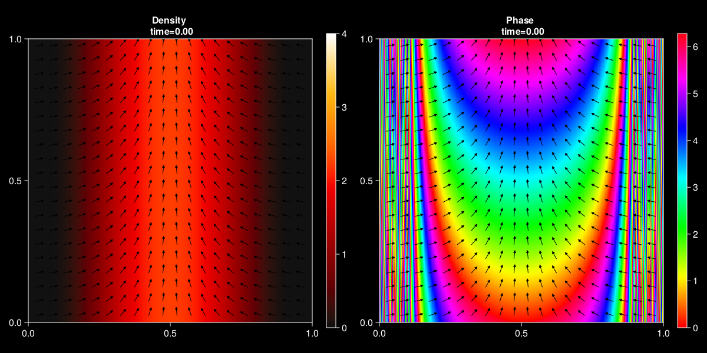

# Supplementary videos for the hydrodynamic swarmalator model in a strip geometry

Simulation of a theoretical travelling-wave solution described in Proposition 3.2 of the second article in three situations. See the article for the detailed parameters.

- **Video 1.** Noiseless Swarmalator Hydrodynamics (NSH) model. This is the model studied in the article. The simulation produces shock-like structures and cannot be simulated for more than a few units of time.

- **Video 2.**  Swarmalator Hydrodynamics (NSH) model with a different velocity field and an additional term in the phase equation. This model can be derived from a particle system with noise in the phase synchronization and it reduces to the NSH model when the noise tends to zero. Although no explicit travelling-wave solution is known for this system, when the noise is small, the model behaves qualitatively as predicted by the theoretical travelling-wave solution in the noiseless case. However, after some time, the travelling-wave solution is destabilized towards a seemingly more stable solution also characterized by a travelling-wave structure but with an additional component along the strip axis.

- **Video 3.** Same setting as Video 2 but with a significantly larger "phase particle noise". In this case, boundary effects quickly destabilize the system. 

<i>Initial condition</i>

